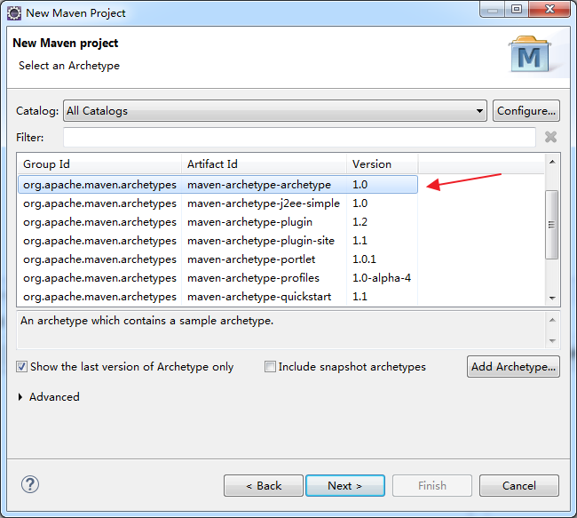
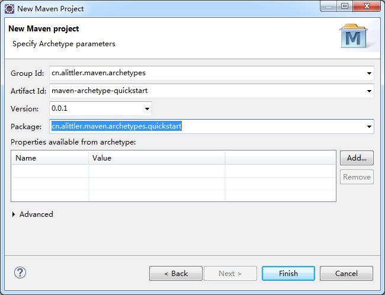
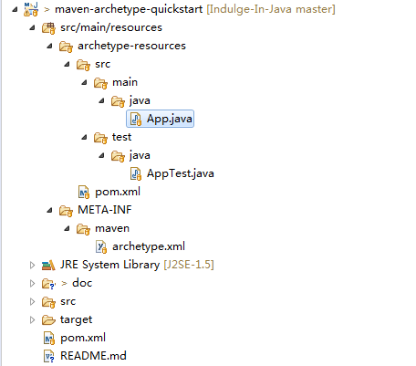
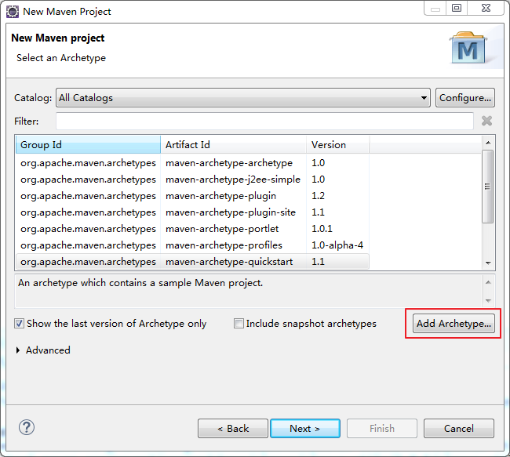
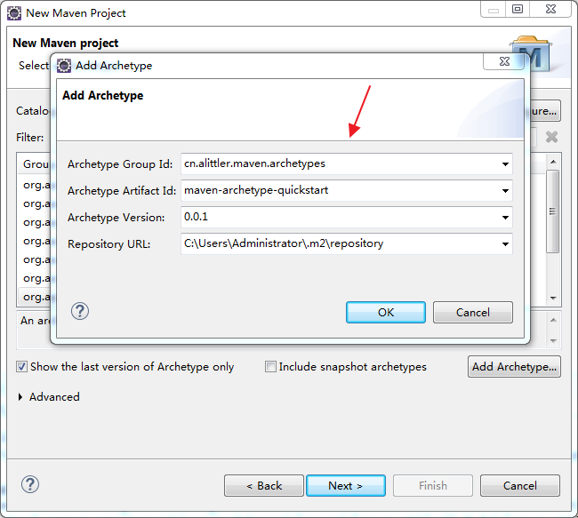
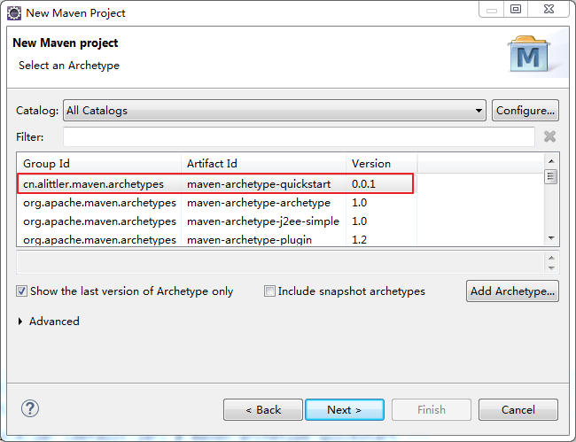
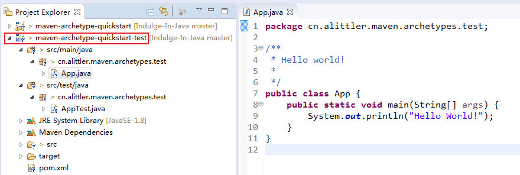

# 自定义maven原型

在eclipse中创建maven项目时，maven自带的原型有些缺点：

依赖的java版本很低，默认的JUnit测试包为低版本的JUnit3，maven打包时文件的编码等问题。每次新建的maven项目都要做一些手动修改，

我们有必要根据自己的需求来自定义maven原型。

maven原型就是maven archetype。

### jar类型	maven-archetype-quickstart


**工具**：eclipse、maven

**步骤**：

新建一个maven项目，maven原型选择maven-archetype-archetype，如下图。



maven原型项目的设置：



新建的原型项目会有src/main/resources目录，该目录自动生成了maven原型项目必要的文件。有几个地方需要自定义修改。



修改App.java文件

```java
package $package;
```

路径maven-archetype-quickstart\src\main\resources\archetype-resources\src\main\java\App.java

修改后如下：

```java
package $package;

/**
 * Hello world!
 *
 */
public class App {
	public static void main(String[] args) {
		System.out.println("Hello World!");
	}
}
```

同样AppTest.java也是修改package

```java
package $package;
```

然后设置原型的pom.xml文件，路径maven-archetype-quickstart\src\main\resources\archetype-resources，该文件主要设置的地方有groupId、artifactId、version、name等，我的自定义设置如下：

```xml
<project xmlns="http://maven.apache.org/POM/4.0.0" xmlns:xsi="http://www.w3.org/2001/XMLSchema-instance"
	xsi:schemaLocation="http://maven.apache.org/POM/4.0.0 http://maven.apache.org/maven-v4_0_0.xsd">
	<modelVersion>4.0.0</modelVersion>

	<groupId>$groupId</groupId>
	<artifactId>$artifactId</artifactId>
	<version>$version</version>
	<name>$artifactId</name>

	<properties>
		<argLine>-Dfile.encoding=UTF-8</argLine>
		<project.build.sourceEncoding>UTF-8</project.build.sourceEncoding>
		<project.reporting.outputEncoding>UTF-8</project.reporting.outputEncoding>
		<java.version>1.8</java.version>
	</properties>

	<dependencies>
		<dependency>
			<groupId>junit</groupId>
			<artifactId>junit</artifactId>
			<version>4.12</version>
			<scope>test</scope>
		</dependency>
	</dependencies>

	<build>
		<plugins>
			<plugin>
				<groupId>org.apache.maven.plugins</groupId>
				<artifactId>maven-compiler-plugin</artifactId>
				<version>3.6.0</version>
				<configuration>
					<source>${java.version}</source>
					<target>${java.version}</target>
					<encoding>UTF-8</encoding>
				</configuration>
			</plugin>
		</plugins>
	</build>
</project>
```
另一个重要的文件archetype.xml，路径maven-archetype-quickstart\src\main\resources\META-INF\maven，该文件设置了要打包到原型的文件。因为我们这个原型比较简单，默认即可。

```xml
<?xml version="1.0" encoding="UTF-8"?>
<!DOCTYPE xml>	<!-- 去掉eclipse中黄色警告 -->
<archetype>
	<id>maven-archetype-quickstart</id>
	<sources>
		<source>src/main/java/App.java</source>
	</sources>
	<testSources>
		<source>src/test/java/AppTest.java</source>
	</testSources>
</archetype>

```

OK，修改以上内容后，其他的默认。

运行我们的maven-archetype-quickstart原型项目，项目右键，Run as ===> Maven install

运行成功后在用户目录.m2\repository，本地仓库中会有自己的原型项目。

然后我们将自己的原型添加到maven的原型列表中，新建maven项目，选择原型的时候添加原型，



在添加原型的弹出框中设置如下：

其中Group Id、Artifact Id、Version是我们原型项目的信息，Repository URI是原型项目的仓库地址，我们这里是本地仓库。



最后maven原型列表中会出现我们自己的maven原型。



新建maven项目时，选择我们自己的maven原型即可。



这样后我们的maven项目就会根据自己的原型做相应的设置。例如java版本不在是原来默认的J2SE-1.5，而是新的1.8，pom.xml文件中的依赖的JUnit jar包不再是JUnit3了。
